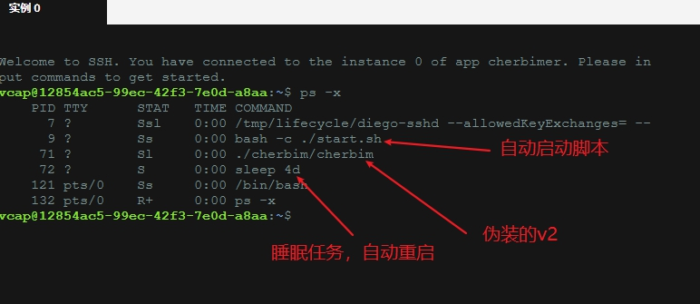
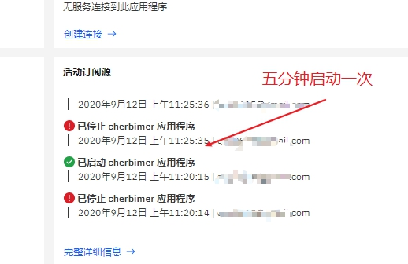
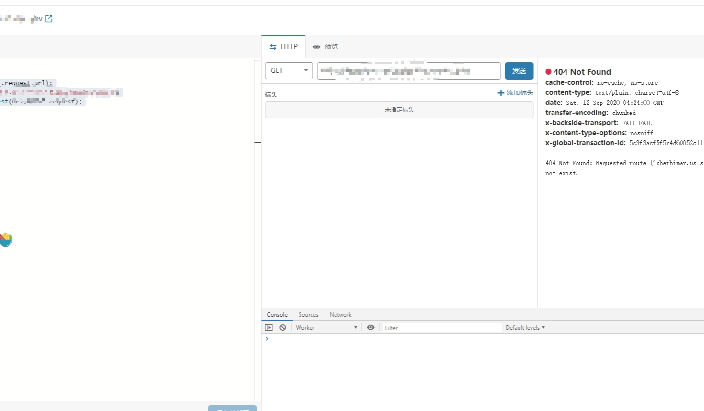
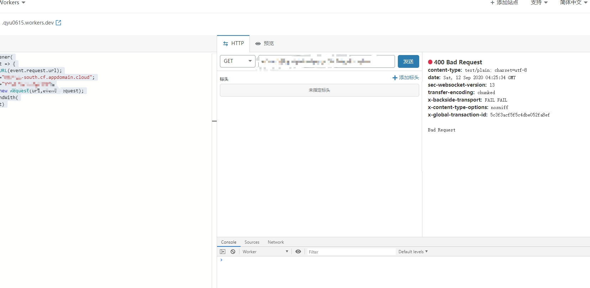

# IBMYesPlus

#### 更新说明

**20200928更新，感觉凉凉，我7个账号都被封了，包含部分未使用账号**

~~**20200919更新 可以继续happy了，新开账号可以开免费容器了**~~

~~**20200916更新 诸位珍惜自己的账号，新开的IBM账号已经不能开免费套餐了，旧账号目前仍可以删除容器重建**~~

上一个版本代码已经不能用了，IBM检测config.json文件，通过压缩文件后上传再解压，继续快乐！

PS：已经安装的不受影响，可以忽略，此脚本只针对新安装的！

20200912更新：

**增加容器内自动重启功能，无需fork！无需fork！无需fork！**，其他改动如下：

1. 增加IBMcloud cf文件（用于容器内自动重启）
2. 增加start.sh执行文件（预启动脚本）
3. 修改生成v2配置代码，vmess自动包含域名，压缩config.json文件，跳过IBM最新验证
4. 更新部分操作步骤说明

 ~~20200910更新~~：

~~整理IBMYes代码，删除多余内容，并做适当更新，主要改动如下：~~

1. ~~增加自动重命名代码，跳过IBM代码审核（修改v2ray名称以跳过代码审核，不知道能稳定多久，能快乐一天是一天）~~

2. ~~容器环境请随意选择，不要对着go疯狂的撸，已测试大部分环境均适用（亲测Python支持除了tomcat之外所有环境，go测试了java python go swift适用，其他没测试）~~

3. ~~验证是否成功方式：域名/随机生成的websocker路径 ，显示Bad Requests就表示正常使用~~

4. ~~v2配置做了修改，增加websocker路径，vmsess链接里无需删除随机路径~~

    


#### 使用说明

1. 自己开容器，环境自己选（看更新说明里的适用环境），安装时会让选择环境参数，1代表go代码，2代表python代码（代码取自IBM示例代码仅用于伪装，选谁都行）

2. 需要设置v2ray伪装名称参数，自行命名（尽可能选择全英文字母）

3. 其他使用教程照搬IBMYes即可，直达链接：https://github.com/CCChieh/IBMYes

4. 能否使用一切随缘，只增加伪装，有问题不要发issue，发了我也解决不了，建议去参考原作者issue

5. 本代码仅自用，顺带方便一下mjj

     

#### 使用步骤

0. 容器环境随便选择（不要选tomcat）

1. 运行一键伪装代码，按照提示输入以下参数

    ~~~
    wget --no-check-certificate -O install.sh https://raw.githubusercontent.com/w2r/IBMYesPlus/master/install.sh && chmod +x install.sh  && ./install.sh
    
    # 安装步骤
    用户名称—>个人邮箱
    用户密码—>密码
    # 输入后会自动登录到IBM cloud，账户正确则提示授权OK，如果未成功登陆，Ctrl + c取消安装，重新运行代码安装
    应用名称—>容器应用名
    应用环境—>1或者2
    # 应用环境自己随便选都可以，都是无用的示例代码，仅用作伪装
    伪装文件名称—>自行命名（尽量全英文）
    内存—>256
    # 然后会自动push到容器，生成的vmess代码可以直接使用
    ~~~

2.   验证是否安装成功方法 

    1. 域名/随机域名，提示Bad requests，则代表成功
    2. 直接复制vmess链接到客户端，看能否访问谷歌

3. 验证后台脚本是否运行

    默认四天重启一次，如需修改，请手动修改start.sh中的以下代码

    ``` 
    # 修改步骤，先运行一键脚本，ctrl c取消安装，编辑install.sh，大约第50行
    
    sleep 4d
    ```

    打开容器详细信息界面，连接ssh

    输入ps -x，如图：

    

    自动重启测试图（5分钟重启一次）：

    

4. cf work脚本代码

    ~~~
    addEventListener(
    "fetch",event => {
    let url=new URL(event.request.url);
    url.hostname="******.us-south.cf.appdomain.cloud";
    let request=new Request(url,event.request);
    event. respondWith(
    fetch(request)
    )
    }
    )
    ~~~

    修改url.hostnam为你自己的，测试是否反代成功，注意get后正常返回是404，不是Bad Request！域名+随机路径返回才是Bad Request，域名返回结果就是404

    vmess链接里已自动加入了随机路径，所以反代域名就行，不用设置路径

    如图：

    

    治疗强迫症患者：

    ~~~
    addEventListener(
    "fetch",event => {
    let url=new URL(event.request.url);
    url.hostname="*****.us-south.cf.appdomain.cloud";
    url.pathname="YYq2vSS7u2OqcBwZ";
    let request=new Request(url,event.request);
    event. respondWith(
    fetch(request)
    )
    }
    )
    ~~~

    需要修改url.hostname和url.pathname，get后返回Bad Request

    注意，**使用这个代码需要去vmess里删除随机路径**

    如图：

    


